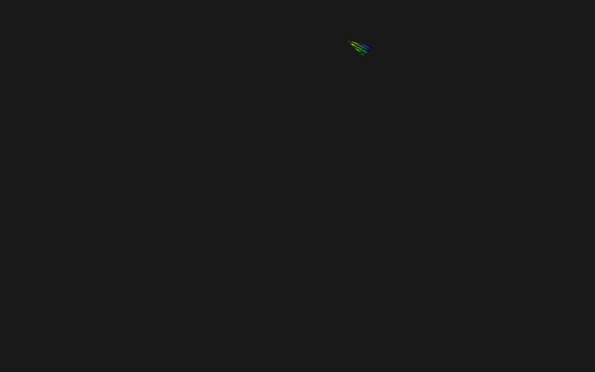

# Asteroid

## Progress Sample



## TODO
* [X] Space Ship Movement/Rotation with User Input
* [X] Random Spawn of Asteroids Spawn
* [X] Asteroid vs Asteroid Collision and Asteroid Dispawn
* [X] FPS display
* [X] Space Ship Projectiles
* [ ] Space Ship vs Asteroid Collision
* [X] Projectile vs Asteroid Collision
* [ ] Scoring System
* [ ] Game Start/End Menu
* [ ] CLEAN THIS SPAGHETTI CODE!!!
  
## Summary
School Project [ Will fill this later ]

## Building with cmake

```bash
$ git clone --recursive https://github.com/RoMarQ/Asteroids
$ cd Asteroids
$ mkdir Build
$ cd Asteroids/Vendor/glad/ && cmake . && make
$ cd ../bullet/ && cmake . && make
$ cd ../../../Build/

# UNIX Makefile
$ cmake ..
$ make && ./Asteroids/Asteroids

# ! This project wasn't tested on Mac and Windows yet, but should work fine.

# Mac OSX
cmake -G "Xcode" ..

# Microsoft Windows
cmake -G "Visual Studio 15" ..
cmake -G "Visual Studio 15 Win64" ..

```

Functionality           | Library
----------------------- | ------------------------------------------
Mesh Loading            | [assimp](https://github.com/assimp/assimp)
Physics                 | [bullet](https://github.com/bulletphysics/bullet3)
OpenGL Function Loader  | [glad](https://github.com/Dav1dde/glad)
Windowing and Input     | [glfw](https://github.com/glfw/glfw)
OpenGL Mathematics      | [glm](https://github.com/g-truc/glm)
Texture Loading         | [stb](https://github.com/nothings/stb)


## Boilerplate Used: [Glitter](https://github.com/Polytonic/Glitter)
